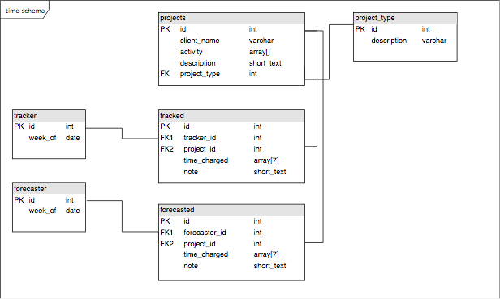
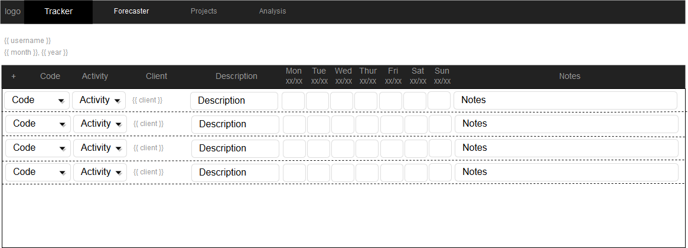
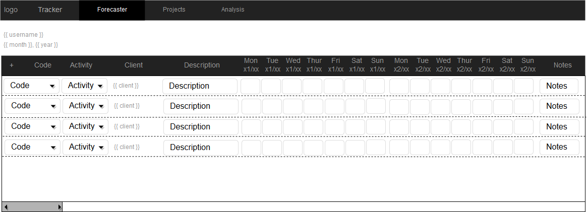
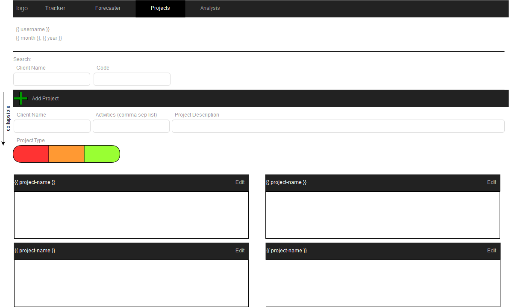
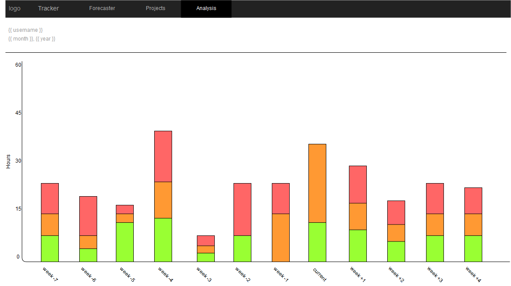

# timecaster app

> _Know Yourself and you will win all battles - Sun Tzu_

> _No Legacy is so rich as Honesty - William Shakespeare_

I am making this as a learning experience for myself, to see if I can learn and implement what I need to make this a functional react/redux application.

An early thank you to all who will have helped me out!

## Pages

1. Time Tracking

> The app provides the ability to record current week activities. You will be able to add pre-defined projects to your list and enter how many hours were spent on that particular day during any given day of that week.

2. Time Forecasting

> The user will be able to charge forecasted hours in this menu for the next 8 weeks.

3. Project tracking

> The user will input projects that will be recorded in the time forecasting and time tracking components.

4. Analysis

> The user will be provided a simple bar graph representing hours charged in the different project type classifications for the past 8 weeks, current week and future 8 weeks.

## Project Development plan

###

1. Logical Design of Data Model
2. Separate out component pieces based on page Diagrams
3. Recognize state hierarchy
4. List components out, and what each component requires in dependencies

### Site Diagram

> Diagrams displaying logical design of SPA application

#### Data Model

#### Tracker

---

#### Forecaster

---

#### Projects

---

#### Analysis

---
